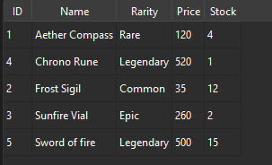

# Digital Library

Python console app that simulates a small library workflow: add/search books, borrow/return,
and persist state to JSON.



## Why This Project Matters
This project demonstrates foundational backend skills in a compact scope:
- object-oriented domain modeling
- deterministic state transitions
- persistence and reload behavior
- automated tests for core logic

## Core Features
- Add, list, and search books
- Borrow and return flows with availability checks
- Save and load library state from `library_data.json`
- Generate a simple operational report

## Architecture
- `Book`, `Reader`, `Library` classes define the domain model.
- A menu-driven CLI orchestrates user actions.
- JSON persistence keeps data durable between sessions.

## Tech Stack
Python, JSON, pytest.

## Quick Start
```bash
python digital_library.py
```

## Demo Flow
```text
1) Add a new book
2) Borrow that book
3) Save data to JSON
4) Restart app and load JSON
5) Confirm state is preserved
```

## Example Output (trimmed)
```text
Books in Central Library:
 - The Little Prince - Antoine de Saint-Exupery - available

==== LIBRARY REPORT ====
Total books: 3
Available books: 2
Borrowed books: 1
```

## Tests
```bash
python -m pytest
```

## Project Structure
```text
digital-library/
+-- digital_library.py
+-- library_data.json
+-- tests/
+-- docs/
```

## Development Timeline
- Core implementation: OOP model, borrow/return rules, JSON persistence, and tests.
- Recent polish: screenshot refresh and README restructuring for clearer technical review.

## Notes
- `library_data.json` can be edited to preload a custom catalog.
- The app starts with a small demo dataset for quick validation.

